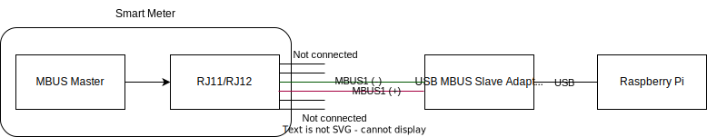
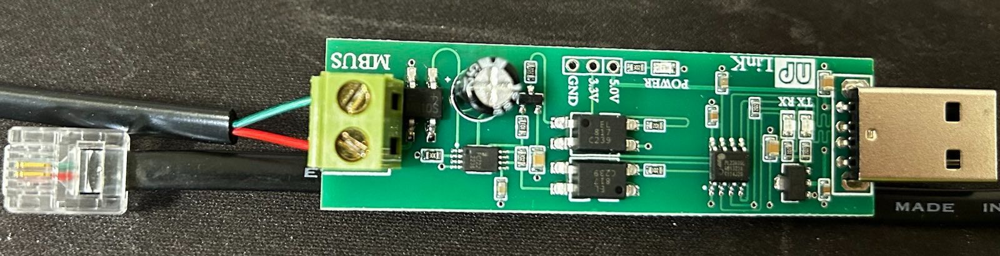

# Integration of Smartmeter (KaifaMA309) into HomeAssistant

This project integrates a Kaifa MA309 smartmeter (such as often in use by Tinetz) into HomeAssistant.
Thanks to [0,1] for this great work! This repository is basically a refactoring with some minor changes.

## Requirements

* Kaifa MA309 smart meter
* AES symmetrical key for decrypting MBUS messages, this can be obtained by your grid provider (Tinetz etc.)
* Raspberry Pi 3/4 (or something that is capable of running docker and has a USB port ;-))
* USB to MBus *Slave* Adapter: <https://de.aliexpress.com/item/1005004874122617.html?gatewayAdapt=glo2deu>, around € 14,54
* RJ-11 or RJ-12 cable

### Hardware Setup

Use the two inner wires and connect them to the USB to MBus adapter:

> Note: I'm not sure if polarity matters or not, so first measure the voltage with a meter; in my case the red wire has +27 V while the green wire was ground and it's working fine





For more/alternative instructions, please follow [2].

### Software

* run:

  ```sh
  sh ./tools/setup.sh
  ```

* for yet unknown reasons, you might be facing issues that the usb port is not constantly named `/dev/ttyUSB0` (but, e.g., `/dev/ttyUSB1` instead) which makes the container fail and unable to recover;
  run the following script for creating an (always correct) symlink to `/dev/smartmeter_modbus`, but make sure that `ls -l /dev/ttyUSB0` is the correct device *prior* to running the script

  ```sh
  # in certain cases, especially since I'm using a RPi Z2W, the USB device, usually mounted to `/dev/ttyUSB0` seems to be disconnecting after a random amount of time
  # the OS reconnects the usb, but using `/dev/ttyUSB1` instead
  # this approach creates a udev symlink which allows us to access the device using `/dev/smartmeter_modbus` regardless of the device file
  SERIAL_NUMBER=$(sudo udevadm info -a -n /dev/ttyUSB0 | grep '{serial}' | head -n1 | tr -d '[:space:]')
  echo "SUBSYSTEM==\"tty\", $SERIAL_NUMBER, SYMLINK+=\"smartmeter_modbus\"" | sudo tee -a /etc/udev/rules.d/999-usb-serial.rules
  sudo udevadm control --reload-rules && sudo udevadm trigger

  # access the device on the host via `/dev/smartmeter_modbus`, no matter if its /dev/ttyUSB0 or /dev/ttyUSB1
  ls -l /dev/smartmeter_modbus

  ## debugging/troubleshooting
  # journalctl -u systemd-udevd
  # udevadm test $(udevadm info -q path -n /dev/ttyUSB0)
  ```

* Create and **manually add your desired values** in the required configuration file:

```bash
export SERIAL_KEY=TODO:yourAESKeyHere
export MQTT_SERVER=TODO:YourMqttServerHere
export MQTT_PORT=TODO:YourMqttPortHereUsually1883
export MQTT_USER=TODO:yourMqttUsernameHere
export MQTT_PASSWD=TODO:YourMqttPasswordHere
export HOST_USB_DEVICE=TODO:YourHostUsbDeviceHere (`/dev/smartmeter_modbus`)

# create the `.env` file for docker configuration
cat << EOF > .env
COMPOSE_PROJECT_NAME=hass-smartmeter

HOST_USB_DEVICE=${HOST_USB_DEVICE}

SERIAL_KEY=${SERIAL_KEY}
MQTT_SERVER=${MQTT_SERVER}
MQTT_PORT=${MQTT_PORT}
MQTT_USER=${MQTT_USER}
MQTT_PASSWD=${MQTT_PASSWD}

# OPTIONAL, in case you are using sentry
# SENTRY_URL=https://....

# OPTIONAL, in case you are using telegraf -> influxdb v2 bridge
# INFLUX_URL=
# INFLUX_TOKEN=
# INFLUX_ORGANIZATION=
# INFLUX_BUCKET=
EOF

# create encrypted `password.txt` file for mosquitto
# https://mosquitto.org/man/mosquitto_passwd-1.html
# 1.) write plain-text file
# Note: you can add more users if desired
cat << EOF > ./docker/mosquitto/config/password.txt
${MQTT_USER}:${MQTT_PASSWD}
EOF

# 2.) encrypt it
podman run -it --rm -v ./docker/mosquitto/config:/tmp eclipse-mosquitto:2 mosquitto_passwd -U /tmp/password.txt
```

* Run the application
  > Always make sure that you have your `.env` file configured properly for the desired services
  * In case you are NOT using `telegraf` and NOT using `mqtt`:

    ```bash
    podman compose up -d
    ```

  * In case you are using `mqtt` but NOT `telegraf`:

    ```bash
    podman compose -f compose.yaml -f docker/mosquitto/compose.mqtt.yaml up -d
    ```

  * In case you are using `mqtt` AND `telegraf`:

    ```bash
    podman compose -f compose.yaml -f containers/mosquitto/compose.mqtt.yaml -f containers/telegraf/compose.telegraf.yaml up -d
    ```

  > Note: it takes a bit (~1') to start, be patient ;-)

* In order to verify functionality, take an MQTT client of your choice, e.g. [MQTT Explorer](http://mqtt-explorer.com/) and connect to it using your configured credentials, you should see messages in the following topics:
  * `$SYS`
  * `home/smart_meter`
* Finally (and optionally), add all the sensors to HomeAssistant. Open the `configuration.yaml` file in HomeAssistant and add the following:

  ```yaml
  mqtt:
    sensor:
      - name: "Energy In"
        unique_id: "smart_meter_energy_in"
        device_class: "energy"
        state_class: "total_increasing"
        unit_of_measurement: "kWh"
        state_topic: "home/smart_meter/energy_in"
      - name: "Power In"
        unique_id: "smart_meter_power_in"
        device_class: "power"
        state_class: "measurement"
        unit_of_measurement: "W"
        state_topic: "home/smart_meter/power_in"
      - name: "Reactice Energy In"
        unique_id: "smart_meter_reactive_energy_in"
        device_class: "energy"
        state_class: "total_increasing"
        unit_of_measurement: "kWh"
        state_topic: "home/smart_meter/reactive_energy_in"
      - name: "Energy Out"
        unique_id: "smart_meter_energy_out"
        device_class: "energy"
        state_class: "total_increasing"
        unit_of_measurement: "kWh"
        state_topic: "home/smart_meter/energy_out"
      - name: "Power Out"
        unique_id: "smart_meter_power_out"
        device_class: "power"
        state_class: "measurement"
        unit_of_measurement: "W"
        state_topic: "home/smart_meter/power_out"
      - name: "Reactice Energy Out"
        unique_id: "smart_meter_reactive_energy_out"
        device_class: "energy"
        state_class: "total_increasing"
        unit_of_measurement: "kWh"
        state_topic: "home/smart_meter/reactive_energy_out"
      - name: "Voltage L1"
        unique_id: "smart_meter_voltage_l1"
        device_class: "voltage"
        state_class: "measurement"
        unit_of_measurement: "V"
        state_topic: "home/smart_meter/voltage_l1"
      - name: "Voltage L2"
        unique_id: "smart_meter_voltage_l2"
        device_class: "voltage"
        state_class: "measurement"
        unit_of_measurement: "V"
        state_topic: "home/smart_meter/voltage_l2"
      - name: "Voltage L3"
        unique_id: "smart_meter_voltage_l3"
        device_class: "voltage"
        state_class: "measurement"
        unit_of_measurement: "V"
        state_topic: "home/smart_meter/voltage_l3"
      - name: "Current L1"
        unique_id: "smart_meter_current_l1"
        device_class: "current"
        state_class: "measurement"
        unit_of_measurement: "A"
        state_topic: "home/smart_meter/current_l1"
      - name: "Current L2"
        unique_id: "smart_meter_current_l2"
        device_class: "current"
        state_class: "measurement"
        unit_of_measurement: "A"
        state_topic: "home/smart_meter/current_l2"
      - name: "Current L3"
        unique_id: "smart_meter_current_l3"
        device_class: "current"
        state_class: "measurement"
        unit_of_measurement: "A"
        state_topic: "home/smart_meter/current_l3"
  ```

* now restart your HA and you should see the sensors.

## Run

In case docker doesn't want to work, you can simply run the following script to test whether values are updated.

> Note that this requires an MQTT server to run, i.e. `docker compose -f docker-compose.yaml -f docker/mosquitto/docker-compose.mqtt.yaml up mqtt`

```bash
python ha_bridge.py \
    --log_console True \
    --serial_key=YOUR_SMARMETER_KEY \
    --mqtt_server=YOUR_MQTT_SERVER \
    --mqtt_port=YOUR_MQTT_PORT \
    --mqtt_user=YOUR_USER \
    --mqtt_passwd=YOUR_PASSWORD \
    --serial_port=/dev/my_usb
```

## Thanks to

First of all thanks to "tirolerstefan" and Michael Reitbauer for the great work that
helped me to realize this project based on their implementations.

* [0] <https://github.com/peerdavid/smartmeter-ha>
* [1] <https://github.com/tirolerstefan/kaifa/>
* [2] <https://www.michaelreitbauer.at/kaifa-ma309-auslesen-smart-meter-evn/>
* [3] <https://www.tinetz.at/uploads/tx_bh/tinetz_smart-meter_beschreibung-kundenschnittstelle_001.pdf>
