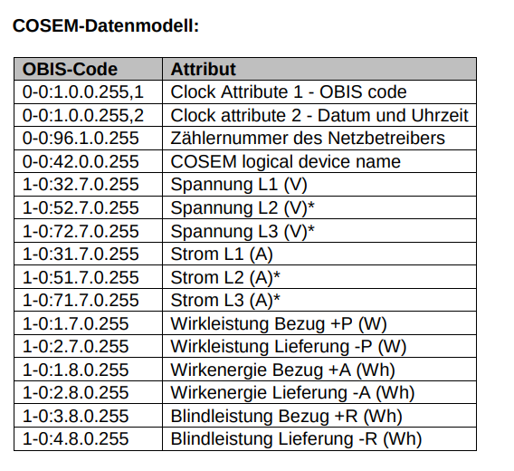

# Integration of Smartmeter(KaifaMA309) into HomeAssistant
This project integrates a KaifaMA309 smartmeter into HomeAssistant.

# Setup

## Hardware
Please follow https://www.michaelreitbauer.at/kaifa-ma309-auslesen-smart-meter-evn/
I used exactly this hardware setup.

## Software
For the initial setup call `./setup.sh` which installs all the dependencies.
Then simply call `python main.py --key="YOUR_KEY"`. You can also add this to the bashrc file in order to
ensure that its running when your Raspberry restarts.

The following table from [3] shows the data model:

# Thanks to
First of all thanks for "tirolerstefan" and Michael Reitbauer for the great work that
helped me to realize this project based on their implementations.
[1] https://github.com/tirolerstefan/kaifa/  
[2] https://www.michaelreitbauer.at/kaifa-ma309-auslesen-smart-meter-evn/  
[3] https://www.tinetz.at/uploads/tx_bh/tinetz_smart-meter_beschreibung-kundenschnittstelle_001.pdf  